# Benchmark of various web-frameworks

> Tests for minimal machines with limited resources (1 vCPU, 1 Gb RAM).

_Note that all tests are performed on a dedicated vCPU. Results may vary for cheap VPS plans that use shared CPU resoirces_

- [Benchmark of various web-frameworks](#benchmark-of-various-web-frameworks)
  - [Tests](#tests)
  - [Frameworks](#frameworks)
    - [Go. Echo.](#go-echo)
    - [JS. Express.](#js-express)
    - [Crystal. Kemal.](#crystal-kemal)
    - [Python. Flask. Gevent](#python-flask-gevent)
    - [Python. Aiohttp. UVloop.](#python-aiohttp-uvloop)
    - [Clojure. Ring. Jetty.](#clojure-ring-jetty)
    - [Clojure. Http-kit.](#clojure-http-kit)
    - [Clojure. Undertow.](#clojure-undertow)
    - [Scala. Play. Akka.](#scala-play-akka)
    - [Elixir. Phoenix. OTP.](#elixir-phoenix-otp)
    - [Elixir. Plug. OTP.](#elixir-plug-otp)
    - [Ruby. Synchrony.](#ruby-synchrony)
    - [Ruby. Sinatra. Puma.](#ruby-sinatra-puma)
    - [Lua. Openresty. Nginx.](#lua-openresty-nginx)
    - [Java. Vertx.](#java-vertx)
    - [Haskell. Hasura.](#haskell-hasura)
  - [Mule script](#mule-script)


## Tests

- Simple random tiny JSON response.
  ```bash
  wrk -t12 -c400 -d240s http://vagrant-machine:8080/json --timeout 10s
  ```

  Detailed results can be found [here](./_results/benchmark-results-json-2sec.md).

  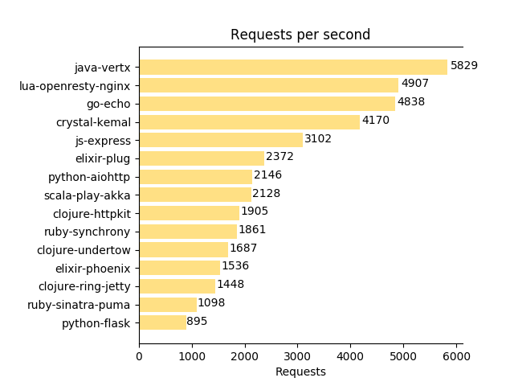
  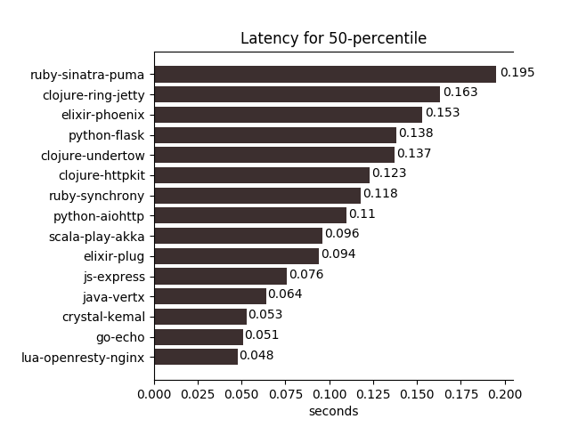
  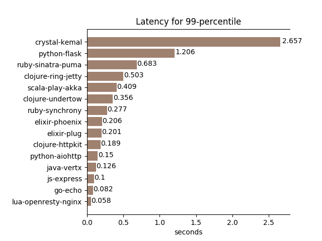
  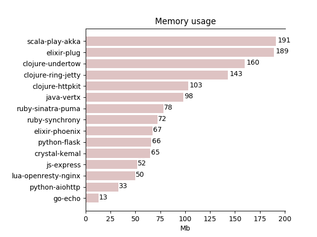
  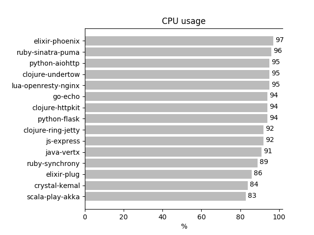


- Postgres DB call that does `sleep random(2 sec)` mimicking random long queries and random js response
  generated 100 times to simulate post-processing. DB pool size is 400.
  ```bash
  wrk -t12 -c400 -d240s http://vagrant-machine:8080/db --timeout 10s
  ```

  Detailed results can be found [here](./_results/benchmark-results-db-2sec.md).

  
  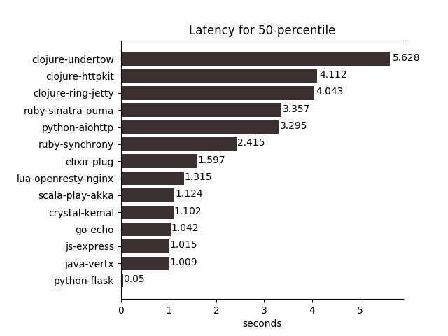
  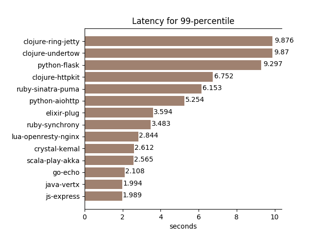
  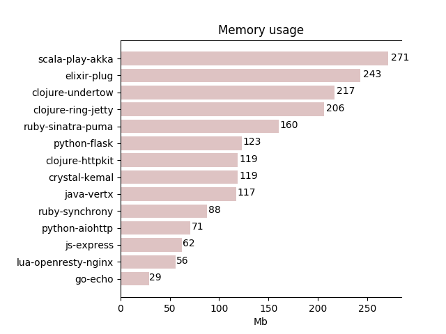
  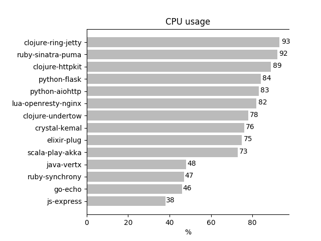


- Postgres DB call that does `SELECT count(*) FROM pg_catalog.pg_user` mimicking fast queries and random js response
  generated 100 times to simulate post-processing. DB pool size is 400.
  ```bash
  wrk -t12 -c400 -d240s http://vagrant-machine:8080/db --timeout 10s
  ```

  Detailed results can be found [here](./_results/benchmark-results-db-0sec.md).

  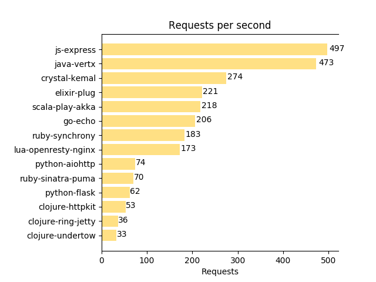
  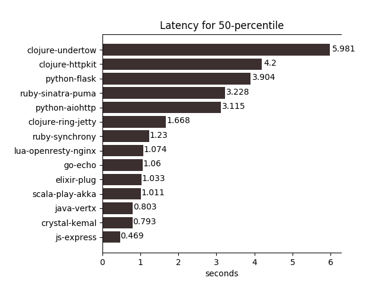
  
  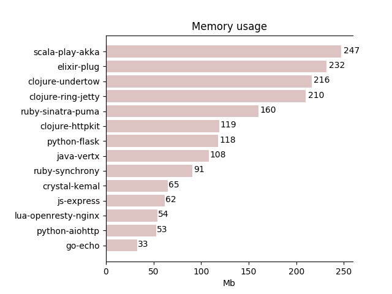
  

## Frameworks

Every framework section has 2 (or 3) words: Language. Framework name. (Web server name or networking library).

### Go. Echo.

- [Echo](https://github.com/labstack/echo)

Logging disabled.


### JS. Express.

- [NodeJS site](nodejs.org)
- [Express site](https://expressjs.com)


### Crystal. Kemal.
- [Crystal lang](https://crystal-lang.org)
- [Kemal web framework](https://kemalcr.com)


### Python. Flask. Gevent

- [Flask](http://flask.pocoo.org)
- [Gunicorn](http://gunicorn.org/#docs)
- [Gevent](http://www.gevent.org)

With setup: 'Gunicorn as a web-server. 4 workers. Worker type - async: eventlet' server gives only 3-4 req/s
which is very low.

Tuned bare gevent is much better.


### Python. Aiohttp. UVloop.

- [Aiohttp](https://aiohttp.readthedocs.io/en/stable/index.html)
- [uvloop](https://github.com/MagicStack/uvloop)
- [acyncpg](https://magicstack.github.io/asyncpg)

Strange, but UVloop gives no benefits for `db/` endpoint.


### Clojure. Ring. Jetty.

- [Ring](https://github.com/ring-clojure/ring)
- [Jetty](https://www.eclipse.org/jetty)

Jetty with all default settings.


### Clojure. Http-kit.

- [Http-kit](https://github.com/http-kit/http-kit)
- [Postgres.async](https://github.com/alaisi/postgres.async)

Event-driven, high-performance clojure server/client library.
With async PG driver.


### Clojure. Undertow.

- [Unertow](http://undertow.io)
- [Undertow-ring](https://github.com/piranha/ring-undertow-adapter)


### Scala. Play. Akka.

- [Play](https://www.playframework.com)
- [Akka](https://akka.io)


### Elixir. Phoenix. OTP.

- [Elixir](https://elixir-lang.org)
- [Phoenix](https://phoenixframework.org)
- [Erlang & OTP](https://www.erlang.org)


### Elixir. Plug. OTP.

- [Elixir](https://elixir-lang.org)
- [Plug](https://github.com/elixir-plug/plug)
- [Erlang & OTP](https://www.erlang.org)


### Ruby. Synchrony.

- [Ruby](https://www.ruby-lang.org)
- [Synchrony](https://github.com/kyledrake/sinatra-synchrony)


### Ruby. Sinatra. Puma.

- [Ruby](https://www.ruby-lang.org)
- [Sinatra](http://sinatrarb.com)
- [Puma](https://puma.io)


### Lua. Openresty. Nginx.

- [Luajit](https://luajit.org)
- [Openresty](https://openresty.org/)
- [Nginx](http://nginx.org)


### Java. Vertx.

- [Vertx](https://vertx.io)

For DB we use async vert.x postgres driver


### Haskell. Hasura.

- [Hasura](https://hasura.io)

Doesn't currently participate in the race, but you can see the results in its directory.
It's quite promising.

## Mule script

`mule` is a script to help you build and run specific framework in a docker-container.

Script can be run in 2 possible ways:

```bash
# 1. From repo's root directory: you need to specify directory of the framework in -d option.
./mule.sh -d go-echo

# 2. From specific framework's directory: no -d option is needed.
cd go-echo
../mule.sh
```

Available actions of using `mule` (assuming the 2nd way of running):

```bash
# Read help for `mule` script
../mule.sh -h

# Build all images
./mule.sh -x

# Build/rebuild image
../mule.sh -b

# Run container
../mule.sh -r

# Run container with attached TTY (to see its output)
../mule.sh -ra

# Kill running container
../mule.sh -k

# Build image, kill container if running, run new w/ attached TTY
../mule.sh -brak

# Run with specific options (loop-count, etc.)
../mule.sh -ra -l 1000
```
